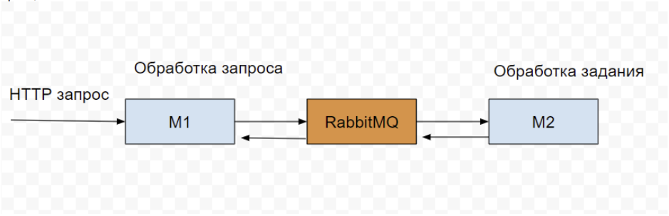

## Microservices setup with RabbitMQ

The app consist of two microservices: GATE (M1) and TASK (M2)

To run application clone repository `git clone git@github.com:antnzr/nestjs-rabbit-loki-snippet.git`
Create `.env` and populate variables from `env.example`, or just run `run_local.sh` it creates and populates data with default settings.
Swagger docs available: `http://localhost:4433/api-docs`.
Call api `curl http://localhost:4433/api/v1` or run from `gate.http` using RestClient extention

#### To monitor logs:

1. Grafana `http://localhost:3033`, username: `admin`, password: `admin`
2. Go to `Configuration` choose `Data source` -> `Loki`
3. Set url `http://ip:3100` (example `http://192.168.0.105:3100`, localhost won't work) and save settings
4. Go to `Explore`, choose `Loki`
5. Select label: `job`
6. Select value: `containerlog`
7. Line containes: `TASK`, `GATE` or any other possible filter

#### Tools:

- Typescript
- Nest.js
- Swagger
- RabbitMQ
- Loki
- Docker, docker-compose

#### Requirments:

- Node.js: >=18
- Docker, docker-compose
- Loki Logging Driver for docker
